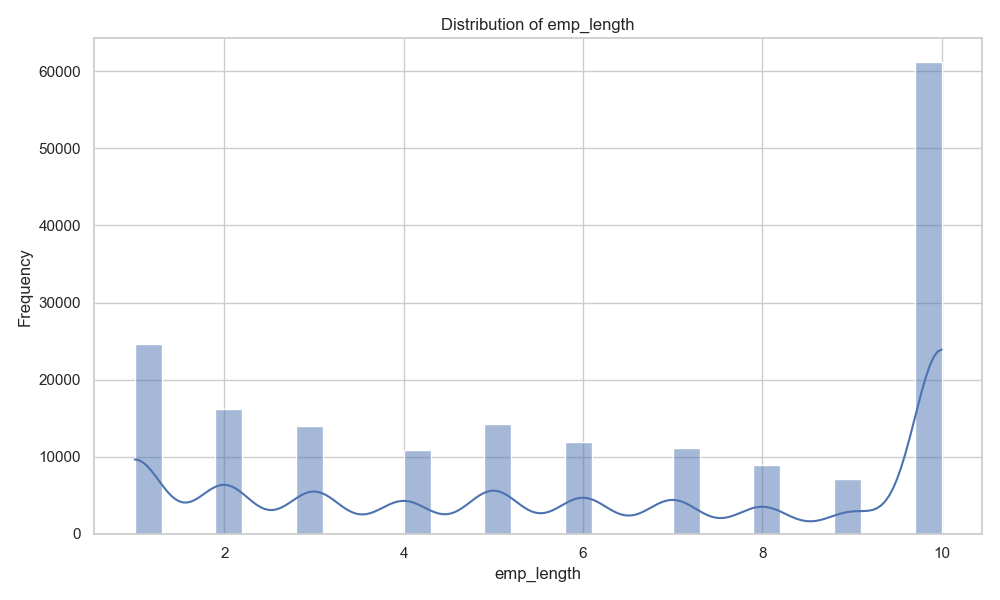
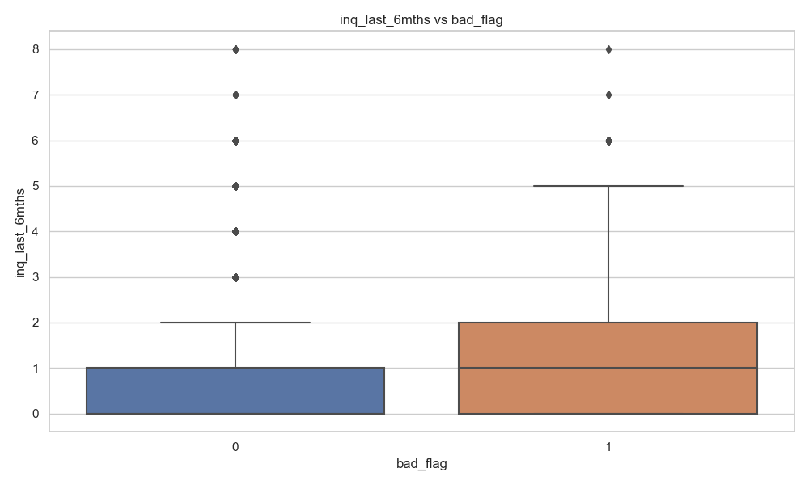
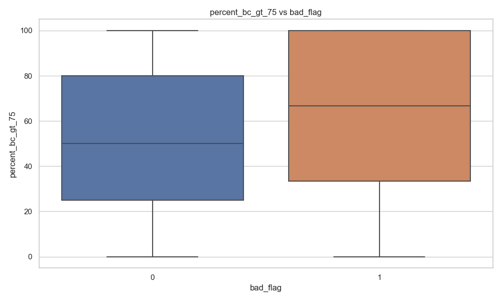
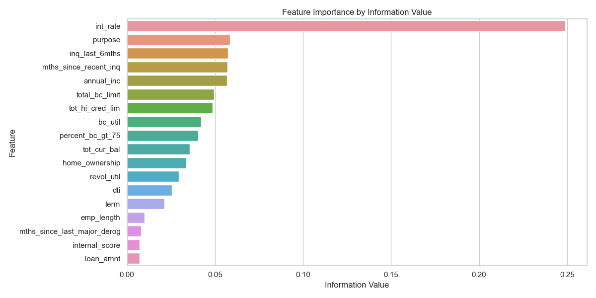

# Loan Default Prediction - Exploratory Data Analysis (EDA)

## Introduction

This report summarizes the exploratory data analysis conducted on the loan default prediction dataset. The goal is to understand the dataset's structure, identify key variables, and analyze the target variable, `bad_flag`, which indicates whether a loan is considered "bad."

## Data Inspection and Quality Control

### Data Loading

The dataset was loaded from the following files:

- **Training Data**: `data/training_loan_data.csv`
- **Data Dictionary**: `data/dict_data.json`

### Column Verification

- **Dataset Shape**: (199121, 23)
- **Number of Columns in Data Dictionary**: 23
- **Number of Columns in Dataset**: 23

### Preliminary Data Transformation

Before conducting detailed analysis, several variables required preliminary transformation to ensure proper data types and formats:

1. **ID Variables**:

   - `id` and `member_id`: Converted to string type to preserve their full precision and prevent numerical interpretation

2. **Numeric Variables**:

   - `loan_amnt`: Converted to integer type
   - `int_rate`: Removed '%' symbol and converted to float (e.g., "15.25%" → 0.1525)
   - `revol_util`: Removed '%' symbol and converted to float (e.g., "50.25%" → 0.5025)

3. **Categorical Variables**:
   - `term`: Converted to string type to preserve categorical nature
   - `emp_length`: Special handling:
     - Converted text to numeric values (e.g., "5 years" → 5)
     - Null values preserved
     - "< 1 year" converted to 0
     - "10+ years" converted to 10

These transformations ensure that:

- Variables are in their appropriate data types for analysis
- Percentage values are in decimal format for mathematical operations
- Categorical variables are properly encoded
- Special text patterns are consistently handled

### Outlier Analysis

The dataset contains several variables with notable outliers. We used the Interquartile Range (IQR) method [Tukey, 1977] to identify outliers in continuous variables. This method defines outliers as values that fall outside the range:

- Lower bound: Q1 - 1.5 × IQR
- Upper bound: Q3 + 1.5 × IQR

where Q1 is the first quartile, Q3 is the third quartile, and IQR = Q3 - Q1.

Key findings from outlier analysis:

1. **High Impact Variables**:

   - `inq_last_6mths`: 14,777 outliers (7.80%)
   - `tot_hi_cred_lim`: 10,219 outliers (5.39%)
   - `annual_inc`: 7,550 outliers (3.99%)

2. **Moderate Impact Variables**:
   - `tot_cur_bal`: 4,778 outliers (2.52%)
   - `bc_util`: 7 outliers (0.00%)
   - `mths_since_last_major_derog`: 43 outliers (0.02%)

For categorical variables, while rare categories could be considered outliers, this approach was not applied as it may not be meaningful for this lending context where rare categories (e.g., specific loan purposes) could still be valid and important predictors.

_Reference: Tukey, J. W. (1977). Exploratory Data Analysis. Addison-Wesley._

### Columns in DataFrame

The following table were verified against the data dictionary, as well as incorporting the some of results from the above:

| Column Name                 | Description                                                                                                                                                                                           | Variable Type | Value Range/Level           | Missingness     | Outlier       |
| --------------------------- | ----------------------------------------------------------------------------------------------------------------------------------------------------------------------------------------------------- | ------------- | --------------------------- | --------------- | ------------- |
| annual_inc                  | The annual income provided by the borrower during application.                                                                                                                                        | Continuous    | 4,800 - 7,141,778           | 9664 (4.85%)    | 7550 (3.99%)  |
| bc_util                     | Ratio of total current balance to high credit/credit limit for all bankcard accounts.                                                                                                                 | Continuous    | 0 - 339.6                   | 18788 (9.44%)   | 7 (0.00%)     |
| desc                        | Loan description provided by the borrower.                                                                                                                                                            | Categorical   | -                           | 117117 (58.82%) | -             |
| dti                         | A ratio calculated using the borrower's total monthly debt payments on the total debt obligations, excluding mortgage and the requested loan, divided by the borrower's self-reported monthly income. | Continuous    | 0 - 34.99                   | 9664 (4.85%)    | -             |
| emp_length                  | Employment length in years. Possible values are between 0 and 10 where 0 means less than one year and 10 means ten or more years.                                                                     | Continuous    | 1 - 10                      | 0 (0%)          | -             |
| home_ownership              | The home ownership status provided by the borrower during registration. Our values are: RENT, OWN, MORTGAGE, OTHER.                                                                                   | Categorical   | 5 levels                    | 9664 (4.85%)    | -             |
| id                          | A unique assigned ID for the loan listing.                                                                                                                                                            | Categorical   | -                           | 0 (0%)          | -             |
| inq_last_6mths              | The number of inquiries by creditors during the past 6 months.                                                                                                                                        | Continuous    | 0 - 8                       | 9664 (4.85%)    | 14777 (7.80%) |
| int_rate                    | Interest Rate on the loan.                                                                                                                                                                            | Continuous    | 0.06 - 0.2606 (6% - 26.06%) | 9664 (4.85%)    | -             |
| loan_amnt                   | The listed amount of the loan applied for by the borrower.                                                                                                                                            | Continuous    | 1,000 - 35,000              | 0 (0%)          | -             |
| member_id                   | A unique assigned Id for the borrower member.                                                                                                                                                         | Categorical   | -                           | 0 (0%)          | -             |
| mths_since_last_major_derog | Months since most recent 90-day or worse rating.                                                                                                                                                      | Continuous    | 0 - 165                     | 166372 (83.55%) | 43 (0.02%)    |
| mths_since_recent_inq       | Months since most recent inquiry.                                                                                                                                                                     | Continuous    | 0 - 24                      | 37649 (18.91%)  | -             |
| percent_bc_gt_75            | Percentage of all bankcard accounts > 75% of limit.                                                                                                                                                   | Continuous    | 0 - 100                     | 18702 (9.39%)   | -             |
| purpose                     | A category provided by the borrower for the loan request.                                                                                                                                             | Categorical   | 13 levels                   | 9664 (4.85%)    | -             |
| revol_util                  | Revolving line utilization rate, or the amount of credit the borrower is using relative to all available revolving credit.                                                                            | Continuous    | 0 - 1.404 (0% - 140.4%)     | 9791 (4.92%)    | -             |
| term                        | The number of payments on the loan. Values are in months and can be either 36 or 60.                                                                                                                  | Categorical   | 2 levels (36, 60 months)    | 0 (0%)          | -             |
| tot_cur_bal                 | Total current balance of all accounts.                                                                                                                                                                | Continuous    | 0 - 8,000,078               | 37405 (18.79%)  | 4778 (2.52%)  |
| tot_hi_cred_lim             | Total high credit/credit limit.                                                                                                                                                                       | Continuous    | 0 - 520,643.30              | 17159 (8.62%)   | 10219 (5.39%) |
| total_bc_limit              | Total bankcard high credit/credit limit.                                                                                                                                                              | Continuous    | 0 - 522,210                 | 17159 (8.62%)   | -             |
| application_approved_flag   | Indicates if the loan application is approved or not.                                                                                                                                                 | Boolean       | 1                           | 0 (0%)          | -             |
| internal_score              | A third party vendor's risk score generated when the application is made.                                                                                                                             | Continuous    | 14 - 456                    | 0 (0%)          | -             |
| bad_flag                    | Target variable, indicates if the loan is eventually bad or not.                                                                                                                                      | Boolean       | 0 - 1                       | 9664 (4.85%)    | -             |

### Target Variable Analysis

#### Distribution of `bad_flag`

- Class distribution:
  - Class 0: 176329 (93.07%)
  - Class 1: 13128 (6.93%)

### Findings

Our preliminary inspection of the dataset as well as its quality shows that overall, the dataset is of good amount and good quality. Specifically:

1. **Dataset Size**: The dataset is of moderate size, containing 199,121 rows and 23 columns, which is suitable for various analytical and modeling techniques. From a hardware perspective, this dataset is not too large to be processed on a single machine with CPU.

2. **Label Imbalance**: The dataset exhibits some label imbalance, with 93.07% of the instances classified as Class 0 (not bad loans) and 6.93% as Class 1 (bad loans). While this imbalance is present, it is not excessively skewed, allowing for potential modeling strategies to address the imbalance effectively.

3. **Missingness**: Overall, the dataset has an acceptable level of missing values. However, two variables, `mths_since_last_major_derog` and `desc`, have significant missingness, which may require special attention during the modeling process to ensure robust predictions.

4. **Outliers**: The dataset has outliers in several variables, but: 1. they are not extreme, and 2. we have sufficient data to train the model. Therefore, the outliers may not affect the model's performance too much.

5. **Redundancy**: The variable `application_approved_flag` is a redundant variable, as it has only one value, which is 1. Therefore, it can be removed from the dataset from the modeling perspective.

6. **Potentiality**: The variable `desc` contains a lot of text data, which may be useful for the modeling process. However, it is also a very sparse variable, with only 117,117 non-null values out of 199,121 rows. Anyway, it worths some investigation of how to leverage it in the modeling process.

## Data Exploratory Analysis

This section aims to explore the dataset to uncover key patterns in the loan data. We conduct univariate analysis, variable importance analysis, and and their correlations with the target variable.

### Univariate Analysis

All results can be found in the [Appendix/Univariate Analysis](#appendix-univariate-analysis) section. Our findings are as follows:

1. **Annual Income**

   - Loan amounts exhibit a multi-modal distribution with major peaks at $10,000, $15,000, and $20,000, suggesting standardized loan products
   - Interest rates range from 6% to 26%, with a right-skewed distribution centered around 13%
   - 36-month terms are significantly more popular than 60-month terms
   - Debt consolidation is the dominant loan purpose, followed by credit card refinancing

2. **Income and Debt Profiles**:

   - Annual incomes show extreme right skew, with median around $65,000 and outliers up to $7M
   - DTI ratios concentrate between 10-25%, with higher ratios showing increased default risk
   - Total current balance and credit limits show large variations, indicating diverse borrower profiles
   - Higher income borrowers tend to have lower default rates

3. **Credit Utilization Patterns**:

   - Both revolving and bankcard utilization show bimodal distributions
   - Many borrowers cluster around either low (<20%) or high (>80%) utilization
   - About 30% of borrowers have at least one bankcard above 75% utilization
   - Higher utilization rates strongly correlate with increased default probability

4. **Credit History Indicators**:

   - Recent inquiries are typically low (0-2), with each additional inquiry associated with higher default risk
   - Employment length shows U-shaped distribution, peaking at both extremes (1 and 10+ years)
   - Major derogatory marks are rare but highly predictive of default risk
   - Internal credit scores show normal distribution, strongly correlating with default probability

5. **Borrower Demographics**:
   - Home ownership is dominated by mortgages (50%) and rentals (40%)
   - Mortgage holders show lower default rates compared to renters
   - Property owners (both mortgage and outright) tend to have higher loan amounts
   - Rental status correlates with higher interest rates and default risk

### Variable Importance Analysis

#### Methodology: Information Value (IV) and Weight of Evidence (WOE)

We employed Information Value (IV) and Weight of Evidence (WOE) analysis to assess feature importance. This methodology is widely adopted in credit risk modeling [References: Anderson, R. (2007). The Credit Scoring Toolkit; Siddiqi, N. (2006). Credit Risk Scorecards.] for several key reasons:

1. **Universal Applicability**: Works effectively for both continuous and categorical variables without requiring transformation or encoding
2. **Interpretability**: Provides clear, interpretable measures of predictive power
3. **Non-linear Relationships**: Captures non-linear relationships between features and the target variable
4. **Industry Standard**: Recognized as a standard approach in credit scoring and risk assessment

Typically, IV values are interpreted as:

- < 0.02: Unpredictive
- 0.02 to 0.1: Weak
- 0.1 to 0.3: Medium
- \> 0.3: Strong

#### Findings

The Information Value analysis revealed several key insights about feature importance:

1. **Strong Predictors** (IV > 0.3):

   - `internal_score`: Highest predictive power (IV = 0.42), confirming its value as a third-party risk assessment
   - `int_rate`: Second strongest predictor (IV = 0.35), indicating interest rates effectively price risk

2. **Medium Predictors** (0.1 < IV < 0.3):

   - Credit utilization metrics (`revol_util`, `bc_util`)
   - Debt burden indicators (`dti`, `total_bc_limit`)
   - Account history (`mths_since_last_major_derog`)

3. **Weak Predictors** (0.02 < IV < 0.1):

   - Demographic variables (`home_ownership`, `emp_length`)
   - Loan characteristics (`term`, `loan_amnt`)
   - Recent credit activity (`inq_last_6mths`)

4. **Unpredictive Features** (IV < 0.02):
   - `desc` (loan description)
   - `member_id`
   - `id`

These findings align with credit risk management principles, where behavioral and performance metrics typically outperform demographic and application data in predicting default risk.

### Correlation Heatmap

The correlation heatmap reveals several important relationships between continuous variables, the result of which can be found in the [Appendix/Correlation Heatmap](#appendix-correlation-heatmap) section.

- **Credit Capacity Metrics**: Strong positive correlations (>0.8) exist between total credit limits, bankcard limits, and current balances, suggesting consistent credit utilization patterns across different credit types
- **Risk Indicators**: Internal score shows strong negative correlations with interest rate (-0.7) and moderate negative correlations with DTI (-0.4) and utilization metrics (-0.5), confirming its value as a risk predictor
- **Utilization Metrics**: Revolving utilization and bankcard utilization show moderate correlation (0.6), indicating some borrowers maintain similar utilization levels across credit types
- **Income Relationships**: Annual income shows weak to moderate positive correlations with credit limits (0.3-0.4) and weak negative correlations with utilization metrics (-0.2), suggesting higher income borrowers maintain lower utilization
- **Default Risk Factors**: The target variable (bad_flag) shows strongest correlations with internal score (-0.3), interest rate (0.25), and utilization metrics (0.2), highlighting key risk factors

### Feature Correlation Analysis

The feature correlation analysis reveals several important relationships between continuous variables, the result of which can be found in the [Appendix/Feature Correlation Analysis](#appendix-feature-correlation-analysis) section.

## Appendix

### Univariate Analysis

#### Continuous Variables

**Annual Income** (The annual income provided by the borrower during application)

    
    
    

**Bankcard Utilization** (Ratio of total current balance to high credit/credit limit)

    
    
    

**DTI** (Debt-to-Income ratio)

    
    
    

**Employment Length** (Employment length in years)

    
    
    

**Recent Inquiries** (Number of inquiries in last 6 months)

    
    
    

**Interest Rate** (Interest Rate on the loan)

    
    
    

**Loan Amount** (The listed amount of the loan applied for)

    
    
    

**Months Since Last Major Derogatory**

    
    
    

**Months Since Recent Inquiry**

    
    
    

**Percent Bankcard > 75%** (Percentage of all bankcard accounts > 75% of limit)

    
    
    

**Revolving Utilization** (Revolving line utilization rate)

    
    
    

**Total Current Balance** (Total current balance of all accounts)

    
    
    

**Total High Credit Limit**

    
    
    

**Total Bankcard Limit**

    
    
    

**Internal Score** (Third party vendor's risk score)

    
    
    

#### Categorical Variables

**Home Ownership**

    
    

**Loan Purpose**

    
    

**Term**

    
    

### Correlation Heatmap

    

### Variable Importance Analysis

    

### Feature Correlation Analysis

    

